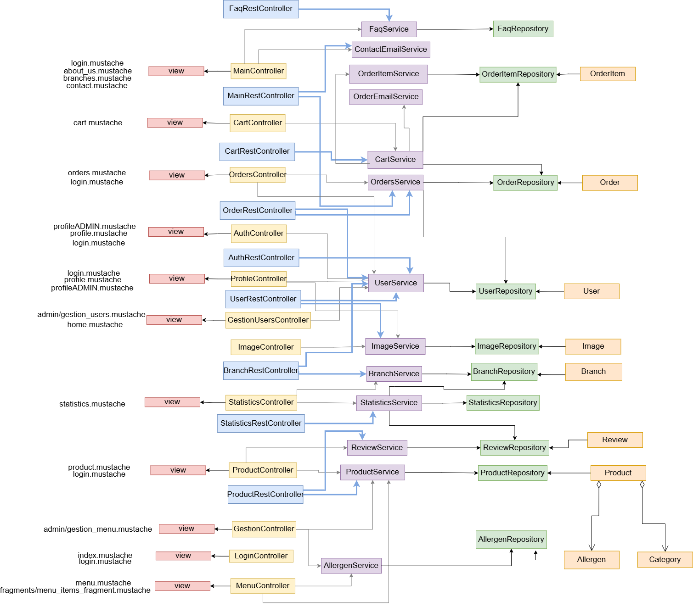
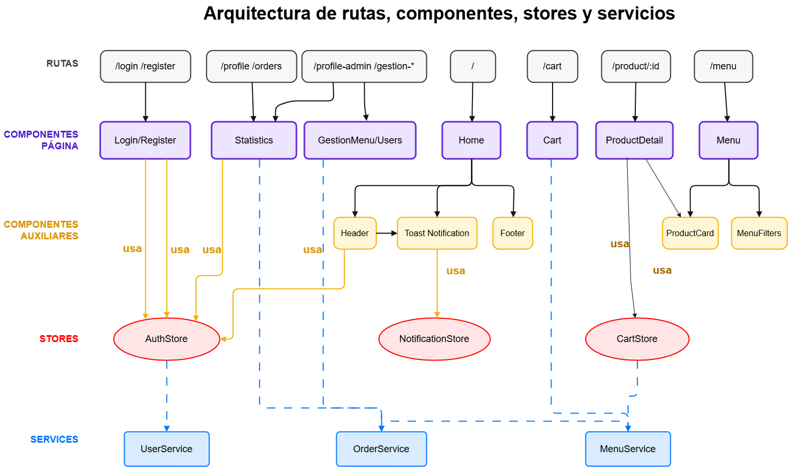

# Mokaf

## 👥 Miembros del Equipo

| Nombre y Apellidos            | Correo URJC                     | Usuario GitHub |
| :---------------------------- | :------------------------------ | :------------- |
| Gonzalo Pérez Roca            | g.perezr.2019@alumnos.urjc.es   | gonzaloperz    |
| Jordi Guix Betancor           | j.guix.2023@alumnos.urjc.es     | Jordigb44      |
| Guillermo Blázquez Barbacid   | g.blazquez.2019@alumnos.urjc.es | Blazk0o        |
| Elinee Nathalie Freites Muñoz | en.freites.2022@alumnos.urjc.es | ElineeF        |
| Alexandra Cararus Verdes      | a.cararus.2021@alumnos.urjc.es  | alexandraaCS   |

---

## 🎭 **Preparación 1: Definición del Proyecto**

### **Descripción del Tema**

Mokaf es una aplicación web diseñada para una cafetería de especialidad. Permite a los usuarios consultar la carta de cafés, bebidas frías, postres y más. Los usuarios pueden registrarse para acceder a funcionalidades personalizadas, mientras que los administradores tienen herramientas para gestionar el catálogo de productos y visualizar estadísticas de ventas.

### **Entidades**

Indicar las entidades principales que gestionará la aplicación y las relaciones entre ellas:

1. **Usuario (User)**: Entidad base que representa a cualquier usuario registrado en el sistema.
2. **Cliente (Customer)**: Extiende de Usuario. Representa a los clientes de la cafetería. Incluye información de envío.
3. **Administrador (Admin)**: Extiende de Usuario. Representa al personal con permisos de gestión. Tiene un ID de empleado.
4. **Producto (Product)**: Representa los artículos del menú (cafés, postres, etc.).
5. **Pedido (Order)**: (Planificado) Representa la compra realizada por un cliente.

**Relaciones entre entidades:**

- **Herencia**: Cliente y Administrador heredan de Usuario (Estrategia JOINED).
- **Usuario - Pedido**: Un clientes puede realizar múltiples pedidos (1:N).
- **Pedido - Producto**: Un pedido puede contener varios productos (N:M).
- **Producto - Categoría**: Los productos se categorizan (Hot, Cold, Blended, Desserts, Non-Coffee).

### **Permisos de los Usuarios**

Describir los permisos de cada tipo de usuario e indicar de qué entidades es dueño:

- **Usuario Anónimo**:
  - Permisos: Visualización de la página de inicio, menú completo, página "Sobre Nosotros" y contacto. Acceso a Login y Registro.
  - No es dueño de ninguna entidad.

- **Usuario Registrado (Cliente)**:
  - Permisos: Gestión de su perfil de usuario, visualización del carrito de compra.
  - Es dueño de: Su Perfil de Usuario, sus Pedidos.

- **Administrador**:
  - Permisos: Acceso al panel de estadísticas y gestión de productos.
  - Es dueño de: Gestión del catálogo de productos.

### **Imágenes**

Indicar qué entidades tendrán asociadas una o varias imágenes:

- **Producto**: Cada ítem del menú tiene una imagen representativa (ej. `Expreso.png`, `Croisants.png`).
- **Estadísticas**: El dashboard incluye visualizaciones gráficas pre-generadas.

### **Gráficos**

Indicar qué información se mostrará usando gráficos y de qué tipo serán:

- **Estadísticas de Ventas**: Gráfico de barras/líneas mostrando el rendimiento del negocio (visualizado actualmente como imagen estática en la sección de estadísticas).

### **Tecnología Complementaria**

Indicar qué tecnología complementaria se empleará:

- **Java 21**: Lenguaje de programación principal.
- **Spring Boot 3.5.6**: Framework para el backend.
- **Mustache**: Motor de plantillas para generar el HTML en el servidor.
- **Hibernate / JPA**: Para la persistencia de datos (MySQL).
- **Bootstrap 5.3.3**: Framework CSS para el diseño responsivo.
- **FontAwesome**: Para iconos.

### **Algoritmo o Consulta Avanzada**

Indicar cuál será el algoritmo o consulta avanzada que se implementará:

- **Algoritmo/Consulta**: Sistema de recomendación de productos (Planificado).
- **Descripción**: Sugerir productos basados en la categoría del último pedido del usuario.

---

## 🛠 **Preparación 2: Maquetación de páginas con HTML y CSS**

### **Vídeo de Demostración**

📹 **[Enlace al vídeo en YouTube](https://youtu.be/uH2RzrRA0A4)**

> Vídeo mostrando las principales funcionalidades de la aplicación web.

### **Diagrama de Navegación**

Diagrama que muestra cómo se navega entre las diferentes páginas de la aplicación:


> [Descripción del flujo de navegación:"Los usuarios no autenticados, al igual que a cualquier rol puede acceder a la página de inicio, ver el menú de productos disponibles, consultar las distintas sucursales, viistar la sección de Nosotros, página de contacto, acceso al login y registro y a las páginas de errores.]

> [Un usuario registrado, podrá comprar productos, añadir productos al carrito, verificar el resúmen de su pedido, acceder al su perfil, consultar el historial de pedidos y getsión de datos personales.]

> [Por último pero no menos importante, el rol de Administrador tendrá acceso a su propio perfil, gestión de productos (crear, eliminar y editar), visualizar estadísticas de las últimas ventas y tener una visión global del funcionamiento del negocio."]

## 🛠 **Práctica 1: Web con HTML generado en servidor y AJAX**

### **Vídeo de Demostración**

📹 **[Enlace al vídeo en YouTube](https://youtu.be/uiRwRkNkf9g)**

> Vídeo mostrando las principales funcionalidades de la aplicación web.

### **Navegación y Capturas de Pantalla**

#### **Diagrama de Navegación**


> [Descripción del flujo de navegación: "Los usuarios no autenticados, al igual que cualquier rol, pueden acceder a la página de inicio, ver el menú de productos disponibles, consultar las distintas sucursales, visitar la sección de Nosotros, la página de contacto, acceder al login y registro, y visualizar las páginas de errores."]

> [Un usuario registrado podrá comprar productos, añadir productos al carrito, verificar el resumen de su pedido, acceder a su perfil, consultar su historial de pedidos y gestionar sus datos personales.]

> [Por último, pero no menos importante, el rol de Administrador tendrá acceso a su propio perfil, un panel de administración con gestión de productos (crear, editar y eliminar), gestión de usuarios (visualizar listado, editar información y eliminar usuarios), visualización de todos los pedidos realizados en la plataforma con su estado y detalles, y un apartado de estadísticas para tener una visión global del funcionamiento del negocio."]

#### **Capturas de Pantalla Actualizadas**

#### **1. Página Principal / Home**


### 2. Menu


### 3. Nosotros


### 4. Sucursales


### 5. Contacto


### 6. Login/Registro


### 7. Producto

#### Usuario sin Login


#### Usuario registrado


### 8. Reseñas


### 9. Perfil Usuario/Administrador


### 10. Gestion


### 11. Estadísticas


### 12. Pedidos

#### Historial pedidos User


#### Historico pedidos Administrador


### 13. Carrito Compra


### **Instrucciones de Ejecución**

#### **Requisitos Previos**

- **Java**: version 21 or higher.
- **Maven**: version 4.0 or higher.
- **MySQL**: version 8.0 or higher.
- **Git**: For cloning the repository
- **Spring Boot Dependencies**: Ensure that all necessary dependencies are included in the pom.xml file for the application.

#### **Pasos para ejecutar la aplicación**

1. **Clonar el repositorio**
   ```bash
   git clone https://github.com/CodeURJC-DAW-2025-26/practica-daw-2025-26-grupo-20.git
   cd practica-daw-2025-26-grupo-20
   ```
2. **Ejecutar MySQL workbench**:
   Abrir MySQL workbench y crear un schema con el nombre mokaf_db, para poder ver la base de datos. Ver que en el `application.properties`.
   ```bash
   spring.datasource.url=jdbc:mysql://localhost:3306/mokaf_db?useSSL=false&allowPublicKeyRetrieval=true&serverTimezone=Europe/Madrid
   spring.datasource.username=root
   spring.datasource.password=1234
   ```

4.1 **Ejecutar la aplicación**:

```bash
mvn clean install -DSkipTest
mvn spring-boot:run
```

4.2 **Acceder a la aplicación**:
Abre tu navegador y ve a `http://localhost:8443`.

#### **Credenciales de prueba**

Actualmente hay de ambos tipos de usuarios en DatabaseInitializer; aconsejamos utilizar la cuenta de admin; , y puedes utilizar la opción de **Registro** en el menú para crear una cuenta nueva y probar las funcionalidades de usuario registrado.

### **Diagrama de Entidades de Base de Datos**

Diagrama mostrando las entidades, sus campos y relaciones:


### **Diagrama de Clases y Templates**

Diagrama de clases de la aplicación con diferenciación por colores o secciones:


### **Participación de Miembros en la Práctica 1**

#### **Alumno 1 - Jordi Guix Betancor**

**Responsabilidades:**

- Implementación del sistema de notificaciones por correo electrónico, incluyendo la generación y envío de facturas en PDF tras la confirmación de pedidos.
- Desarrollo del algoritmo de recomendación dinámica de productos en el menú, personalizando sugerencias para usuarios registrados y filtrando por "best-sellers" para visitantes.
- Creación de un sistema de filtrado de categorías con paginación AJAX en el servidor para optimizar el rendimiento y la experiencia de usuario.
- Implementación de un formulario de contacto robusto con validación en el servidor y gestión de consultas vía email.
- Refuerzo de la seguridad en el registro de usuarios mediante la validación compleja de contraseñas y formatos de correo electrónico.

| Nº  | Commits                                                                                                                                                                                          | Files                                                                                                                                                                                                           |
| :-: | :----------------------------------------------------------------------------------------------------------------------------------------------------------------------------------------------- | :-------------------------------------------------------------------------------------------------------------------------------------------------------------------------------------------------------------- |
|  1  | [feat: Implement order confirmation emails with attached PDF invoices](https://github.com/CodeURJC-DAW-2025-26/practica-daw-2025-26-grupo-20/commit/bff00e073b448b49e29f0e21b63148ecdb6a3f713)   | [OrderEmailService.java](https://github.com/CodeURJC-DAW-2025-26/practica-daw-2025-26-grupo-20/blob/bff00e073b448b49e29f0e21b63148ecdb6a3f713/src/main/java/es/codeurjc/mokaf/service/OrderEmailService.java)   |
|  2  | [feat: add dynamic product recommendations to the menu](https://github.com/CodeURJC-DAW-2025-26/practica-daw-2025-26-grupo-20/commit/ce85a6265c89b6b0e6d088db02f6bad70228325c)                   | [ProductService.java](https://github.com/CodeURJC-DAW-2025-26/practica-daw-2025-26-grupo-20/blob/ce85a6265c89b6b0e6d088db02f6bad70228325c/src/main/java/es/codeurjc/mokaf/service/ProductService.java)          |
|  3  | [feat: Implement category filtering with server-side pagination and AJAX](https://github.com/CodeURJC-DAW-2025-26/practica-daw-2025-26-grupo-20/commit/d349bdb812e5bec224859a88c2b56f84614ae24c) | [MenuController.java](https://github.com/CodeURJC-DAW-2025-26/practica-daw-2025-26-grupo-20/blob/d349bdb812e5bec224859a88c2b56f84614ae24c/src/main/java/es/codeurjc/mokaf/controller/MenuController.java)       |
|  4  | [feat: Implement a functional contact form with server-side validation](https://github.com/CodeURJC-DAW-2025-26/practica-daw-2025-26-grupo-20/commit/59ebd1f6e62c4f5db3d019e5abfefe12c4d41f6d)   | [ContactController.java](https://github.com/CodeURJC-DAW-2025-26/practica-daw-2025-26-grupo-20/blob/59ebd1f6e62c4f5db3d019e5abfefe12c4d41f6d/src/main/java/es/codeurjc/mokaf/controller/ContactController.java) |
|  5  | [feat: Add email and password complexity validation to registration](https://github.com/CodeURJC-DAW-2025-26/practica-daw-2025-26-grupo-20/commit/e944a7042d130460bf887af4f4f5bbc219593bad)      | [AuthController.java](https://github.com/CodeURJC-DAW-2025-26/practica-daw-2025-26-grupo-20/blob/e944a7042d130460bf887af4f4f5bbc219593bad/src/main/java/es/codeurjc/mokaf/controller/AuthController.java)       |

---

#### **Alumno 2 - [Gonzalo Pérez Roca]**

**Responsabilidades:**

- Implementación entidades de la base de datos y modelo Relacional.
- Siembra de datos en la base de datos.
- Implementación MVC de Productos y Reviews.
- Implementación de la paginación en las Review.
- Implementación de la Gestión de Productos(Admin).

| Nº  |                                                                                Commits                                                                                |                                                                                 Files                                                                                  |
| :-: | :-------------------------------------------------------------------------------------------------------------------------------------------------------------------: | :--------------------------------------------------------------------------------------------------------------------------------------------------------------------: |
|  1  | [Add Models and Repository. NO esta terminado](https://github.com/CodeURJC-DAW-2025-26/practica-daw-2025-26-grupo-20/commit/29236a06f9004ad097a4d356d48b31ec5376d84f) |                                                                           [pom.xml](pom.xml)                                                                           |
|  2  |       [Update DatabaseInitializer.java](https://github.com/CodeURJC-DAW-2025-26/practica-daw-2025-26-grupo-20/commit/6b98ae59f3704cb75f1479a8c83b5a140008136e)        |                                      [DatabaseInitializer.java](src/main/java/es/codeurjc/mokaf/config/DatabaseInitializer.java)                                       |
|  3  |                [ADMIN PRODUCTS](https://github.com/CodeURJC-DAW-2025-26/practica-daw-2025-26-grupo-20/commit/64586826e78f57c1be261da3fcc40189fb9d94ad)                | [GestionController](https://github.com/CodeURJC-DAW-2025-26/practica-daw-2025-26-grupo-20/blob/main/src/main/java/es/codeurjc/mokaf/controller/GestionController.java) |
|  4  |      [Add Pageable-Review- NewReviewSeed](https://github.com/CodeURJC-DAW-2025-26/practica-daw-2025-26-grupo-20/commit/54ad14c35e70740f2a52a15f3cf0a2b6fbeaed39)      |                                                                     [ReviewService](URL_archivo_4)                                                                     |
|  5  |      [Static Reviews, present mustaches](https://github.com/CodeURJC-DAW-2025-26/practica-daw-2025-26-grupo-20/commit/f6fb74512965c00cee0abcb61a7c76303d022d31)       |           [Product.mustache](https://github.com/CodeURJC-DAW-2025-26/practica-daw-2025-26-grupo-20/blob/main/src/main/resources/templates/product.mustache)            |

---

#### **Alumno 3 - Guillermo Blázquez Barbacid**

- Implementación de la seguridad de la aplicación.
- Implementación de la sesión de los usuarios.
- Implementación de los perfiles de usuario y administrador.
- Personalización y actualizacion de los perfiles.
- Implementación de la seguridad de las imágenes privadas.

| Nº  |                                                                                                                 Commits                                                                                                                 |                                          Files                                           |
| :-: | :-------------------------------------------------------------------------------------------------------------------------------------------------------------------------------------------------------------------------------------: | :--------------------------------------------------------------------------------------: |
|  1  | [Seguridad de los usuarios y sus imagenes](https://github.com/CodeURJC-DAW-2025-26/practica-daw-2025-26-grupo-20/commit/841905dcd28c98bd737f2cb46cacca2a2bb6916e#diff-1b3e30b52d60a14864bdd58685318226b6fcf8ac4120bec12ca014926e610997) |     [ImageSeervice.java](src/main/java/es/codeurjc/mokaf/service/ImageService.java)      |
|  2  |                                [Creación de la sesiones permanentes por usuario](https://github.com/CodeURJC-DAW-2025-26/practica-daw-2025-26-grupo-20/commit/cb90e1ea4dd58b6deb247d4b53e15ed943b29fd6)                                 |     [AuthController](src/main/java/es/codeurjc/mokaf/controller/AuthController.java)     |
|  3  |                                       [Configuración de csrf y un debuger](https://github.com/CodeURJC-DAW-2025-26/practica-daw-2025-26-grupo-20/commit/2c70cfe6bd1ce0996295946bb0c970c631a09bc8)                                       | [CsrfModelInterceptor](src/main/java/es/codeurjc/mokaf/config/CsrfModelInterceptor.java) |
|  4  |                                           [Configuración de seguridad](https://github.com/CodeURJC-DAW-2025-26/practica-daw-2025-26-grupo-20/commit/3ca6c89b7b72b52028f4cd5ea15f78f97077588e)                                           |       [SecurityConfig](src/main/java/es/codeurjc/mokaf/config/SecurityConfig.java)       |
|  5  |                                   [Profile save changes and images for users](https://github.com/CodeURJC-DAW-2025-26/practica-daw-2025-26-grupo-20/commit/f20e83f0224173910d58e9793b4690e2c7a7b80e)                                    |  [ProfileController](src/main/java/es/codeurjc/mokaf/controller/ProfileController.java)  |

---

#### **Alumno 4 - [Elinee Nathalie Freites Muñoz]**

- Implementación del carrito y compras.
- Implementación de estadísticas de administrador.
- Implementación de diagrama de clases y templates
- Implementación de descuento por sucursal
- Implementación de rating de productos mejor valorados.
- Implementación de ganancias totales por sucursal y sucursal destacada.

| Nº  |                                                                                           Commits                                                                                            |                                                                                                      Files                                                                                                       |
| :-: | :------------------------------------------------------------------------------------------------------------------------------------------------------------------------------------------: | :--------------------------------------------------------------------------------------------------------------------------------------------------------------------------------------------------------------: |
|  1  |                     [Statistics and Branch fixed](https://github.com/CodeURJC-DAW-2025-26/practica-daw-2025-26-grupo-20/commit/22d30f9fe0580916bd537d7f085c1e985298cf67)                     | [StatisticsService](https://github.com/CodeURJC-DAW-2025-26/practica-daw-2025-26-grupo-20/commit/22d30f9fe0580916bd537d7f085c1e985298cf67#diff-30af0402e948daf26c29b0546234c002186891fa15400407f17a163ab88924b8) |
|  2  | [Cart impementation, braches discount and order create after paying.](https://github.com/CodeURJC-DAW-2025-26/practica-daw-2025-26-grupo-20/commit/30388e7e660e40436359d457fec96c0bad20c3d2) |                                                                     [CartService](src/main/java/es/codeurjc/mokaf/service/CartService.java)                                                                      |
|  3  |                            [Better Stats](https://github.com/CodeURJC-DAW-2025-26/practica-daw-2025-26-grupo-20/commit/cfb96db25a2603b589a9ef1e24367af25ec3568e)                             |                                                               [StatisticsService](src/main/java/es/codeurjc/mokaf/service/StatisticsService.java)                                                                |
|  4  |         [DatabaseInit Changes and deleting Branch attribute](https://github.com/CodeURJC-DAW-2025-26/practica-daw-2025-26-grupo-20/commit/bd5d4b30c2a33163b50f9c2f74401f96f8489068)          |                                                              [DatabaseInitializer](src/main/java/es/codeurjc/mokaf/config/DatabaseInitializer.java)                                                              |
|  5  |                    [Fixing controllers and paths](https://github.com/CodeURJC-DAW-2025-26/practica-daw-2025-26-grupo-20/commit/aeb02f7c3b67da06d9a0ff7fbfd9d947ee3ff4bb)                     |                                                                 [MainController](src/main/java/es/codeurjc/mokaf/controller/MainController.java)                                                                 |

---

#### **Alumno 5 - [Alexandra Cararus Verdes ]**

- Implementación de sucursales.
- Implementación de ver ordenes desde administrador y usuario.
- Implementación de pagina Contacto.
- Implementación de pagina Nosotros
- Correcion de errores.
- Video

| Nº  |                                                                     Commits                                                                     |                                         Files                                          |
| :-: | :---------------------------------------------------------------------------------------------------------------------------------------------: | :------------------------------------------------------------------------------------: |
|  1  | [Implementation page Contact](https://github.com/CodeURJC-DAW-2025-26/daw-2025-26-project-base/commit/73de3f9cc96945554612ba09a4f54dc0ec918011) | [ContactController](src/main/java/es/codeurjc/mokaf/controller/ContactController.java) |
|  2  |          [About Us ](https://github.com/CodeURJC-DAW-2025-26/daw-2025-26-project-base/commit/0198c098c41e0ed8b5d320e3245da82c401677f6)          |          [about_us.mustache](src/main/resources/templates/nosotros.mustache)           |
|  3  |        [Page Branches](https://github.com/CodeURJC-DAW-2025-26/daw-2025-26-project-base/commit/8f9cac72e4f5e72dad6fc6a1fccb909cde8db92d)        |        [sucursales.mustache](src/main/resources/templates/sucursales.mustache)         |
|  4  |   [Order in user and Admin](https://github.com/CodeURJC-DAW-2025-26/daw-2025-26-project-base/commit/f455c5c722b98163c4c7d3ac9d90e291b5fdff85)   |   [OrderRepository](src/main/java/es/codeurjc/mokaf/repository/OrderRepository.java)   |
|  5  |         [fix Errors](https://github.com/CodeURJC-DAW-2025-26/daw-2025-26-project-base/commit/d2aa6268b8ca909b04abaf4f6056c3953c9bb7ad)          |          [application.properties](src/main/resources/application.properties)           |

---

## 🛠 **Práctica 2: Incorporación de una API REST a la aplicación web, despliegue con Docker y despliegue remoto**

### **Vídeo de Demostración**

📹 **[Enlace al vídeo en YouTube](https://youtu.be/MDhQT2KBTv4)**

> Vídeo mostrando las principales funcionalidades de la aplicación web.

### **Documentación de la API REST**

#### **Especificación OpenAPI**

📄 **[Especificación OpenAPI (YAML)](/api-docs/api-docs.yaml)**

#### **Documentación HTML**

📖 **[Documentación API REST (HTML)](https://rawcdn.githack.com/CodeURJC-DAW-2025-26/practica-daw-2025-26-grupo-20/3a5c7ca37b71636a4d3cafcdd48372f3b1fb6350/api-docs/api-docs.html)**

> La documentación de la API REST se encuentra en la carpeta `/api-docs` del repositorio. Se ha generado automáticamente con SpringDoc a partir de las anotaciones en el código Java.

#### **Endpoints de Autenticación (API REST)**

- `POST /api/v1/auth/sessions` → Inicio de sesión (genera cookies/tokens JWT).
- `POST /api/v1/auth/registrations` → Registro de nuevo usuario cliente.
- `POST /api/v1/auth/tokens` → Renovación de token de acceso con refresh token.
- `DELETE /api/v1/auth/sessions/current` → Cierre de sesión (invalidación de cookies/tokens).

### **Diagrama de Clases y Templates Actualizado**

Diagrama actualizado incluyendo los @RestController y su relación con los @Service compartidos:



> #### Controllers identificados en el diagrama:
>
> - `MainRestController`: Punto de entrada general para operaciones principales.
> - `CartRestController`: Gestión del carrito (añadir, eliminar, actualizar productos).
> - `OrderRestController`: Procesamiento y consulta de pedidos.
> - `AuthRestController`: Autenticación y autorización de usuarios.
> - `UserRestController`: Operaciones sobre usuarios (perfil, gestión).
> - `BranchRestController`: Manejo de sucursales.
> - `StatisticsRestController`: Exposición de métricas y estadísticas.
> - `ProductRestController`: Gestión de productos.
>
> #### Flujo típico:
>
> 1. Cliente realiza petición HTTP → REST Controller.
> 2. El controller valida y procesa la entrada.
> 3. Delega la lógica al Service correspondiente.
> 4. El Service interactúa con los Repositories.
> 5. Se construye la respuesta y se devuelve al cliente.

### **Instrucciones de Ejecución con Docker**

#### **Requisitos previos:**

- Docker instalado (versión 20.10 o superior)
- Docker Compose instalado (versión 2.0 o superior)

#### **Pasos para ejecutar con docker-compose:**

1. **Clonar el repositorio** (si no lo has hecho ya):

   ```bash
   git clone https://github.com/[usuario]/[repositorio].git
   cd [repositorio]
   ```

2. **AQUÍ LOS SIGUIENTES PASOS**:

### **Construcción de la Imagen Docker**

#### **Requisitos:**

- Docker instalado en el sistema

#### **Pasos para construir y publicar la imagen:**

## 🐳 Lanzamiento del Proyecto con Docker en la Máquina Virtual

Sigue estos pasos para lanzar la aplicación Mokaf usando Docker desde la máquina virtual.

---

### 1️⃣ Conexión a la Máquina Virtual

Accede mediante SSH:

ssh -i [ruta/a/clave.key] [usuario]@[IP-o-dominio-VM]

---

### 2️⃣ Clonar el repositorio

git clone https://github.com/CodeURJC-DAW-2025-26/practica-daw-2025-26-grupo-20.git
cd practica-daw-2025-26-grupo-20

---

### 3️⃣ Crear la imagen Docker

Desde la **carpeta raíz del proyecto**, ejecuta:

- **Bash:**
  ./docker/create_image.sh mokaf

- **PowerShell:**
  ./docker/create_image.ps1 mokaf

> Esto genera la imagen de la aplicación lista para publicar en DockerHub.

---

### 4️⃣ Publicar la imagen Docker

- **Bash:**
  ./docker/publish_image.sh

- **PowerShell:**
  ./docker/publish_image.ps1

---

### 5️⃣ Publicar el artefacto Docker Compose

- **Bash y PowerShell:**
  ./docker/publish_docker-compose.sh

> Estos scripts usan el archivo `.env` que debe estar en la carpeta `docker`, con contraseñas y lista de usuarios configuradas.

---

### 6️⃣ Lanzamiento de la aplicación con Docker Compose

1. Accede a la carpeta `docker`:

cd docker

2. Configura el modo según el tipo de arranque:

#### 🔹 Primer arranque (crea la base de datos)

- **Bash:**
  DOCKERHUB_USER=usuario1 SPRING_JPA_HIBERNATE_DDL_AUTO=create docker compose up -d

- **PowerShell:**
  $env:DOCKERHUB_USER="usuario1"
$env:SPRING_JPA_HIBERNATE_DDL_AUTO="create"
  docker compose up -d

#### 🔹 Arranque normal (sin recrear base de datos)

- **Bash:**
  DOCKERHUB_USER=usuario1 SPRING_JPA_HIBERNATE_DDL_AUTO=none docker compose up -d

- **PowerShell:**
  $env:DOCKERHUB_USER="usuario1"
$env:SPRING_JPA_HIBERNATE_DDL_AUTO="none"
  docker compose up -d

> Esto levantará la aplicación junto con todos los servicios definidos en `docker-compose.yml`.

2. **AQUÍ LOS SIGUIENTES PASOS**

### **Despliegue en Máquina Virtual**

#### **Requisitos:**

- Acceso a la máquina virtual (SSH)
- Clave privada para autenticación
- Conexión a la red correspondiente o VPN configurada

#### **Pasos para desplegar:**

1. **Conectar a la máquina virtual**:

   ```bash
   ssh -i [ruta/a/clave.key] [usuario]@[IP-o-dominio-VM]
   ```

   Ejemplo:

   ```bash
   ssh -i ssh-keys/app.key vmuser@10.100.139.XXX
   ```

2. **AQUÍ LOS SIGUIENTES PASOS**:

### **URL de la Aplicación Desplegada**

🌐 **URL de acceso**: `https://[nombre-app].etsii.urjc.es:8443`

#### **Credenciales de Usuarios de Ejemplo**

| Rol                | Usuario | Contraseña |
| :----------------- | :------ | :--------- |
| Administrador      | admin   | admin123   |
| Usuario Registrado | user1   | user123    |
| Usuario Registrado | user2   | user123    |

### **Participación de Miembros en la Práctica 2**

#### **Alumno 1 - Jordi Guix Betancor**

**Responsabilidades:**

- Implementación de la API REST v1 para usuarios, productos y FAQs con DTOs y documentación OpenAPI.
- Incorporación y mantenimiento de la colección de pruebas API en Postman.
- Refactorización de controladores/configuración API para simplificar el backend (incluyendo eliminación de MapStruct).
- Automatización del flujo Docker para creación y publicación de imágenes con scripts de shell.
- Ajustes de seguridad y hardening en endpoints, junto con actualización de baseURL en Postman para entorno local.

| Nº  | Commits                                                                                                                                                                                                                                                 | Files                                                                                                                                                                                                                 |
| :-: | :------------------------------------------------------------------------------------------------------------------------------------------------------------------------------------------------------------------------------------------------------ | :-------------------------------------------------------------------------------------------------------------------------------------------------------------------------------------------------------------------- |
|  1  | [feat: Implement REST API for User, Product, and FAQ entities with dedicated DTOs, REST controllers, and OpenAPI documentation.](https://github.com/CodeURJC-DAW-2025-26/practica-daw-2025-26-grupo-20/commit/075074592111f4c225f5d8a903da567b1d995024) | [UserRestController.java](https://github.com/CodeURJC-DAW-2025-26/practica-daw-2025-26-grupo-20/blob/075074592111f4c225f5d8a903da567b1d995024/src/main/java/es/codeurjc/mokaf/api/controller/UserRestController.java) |
|  2  | [feat: Add Docker build and publish scripts.](https://github.com/CodeURJC-DAW-2025-26/practica-daw-2025-26-grupo-20/commit/2ba1fa447c97174b672269decd8b4bda1fa421bc)                                                                                    | [docker-publish.sh](https://github.com/CodeURJC-DAW-2025-26/practica-daw-2025-26-grupo-20/blob/2ba1fa447c97174b672269decd8b4bda1fa421bc/docker-publish.sh)                                                            |
|  3  | [feat: Add multi-user Docker image publishing, configurable database initialization.](https://github.com/CodeURJC-DAW-2025-26/practica-daw-2025-26-grupo-20/commit/c272ab3755ed54d79203564f31ac9f00dc8eed7a)                                            | [docker-compose.yml](https://github.com/CodeURJC-DAW-2025-26/practica-daw-2025-26-grupo-20/blob/c272ab3755ed54d79203564f31ac9f00dc8eed7a/docker-compose.yml)                                                          |
|  4  | [Create publish and create image by .sh](https://github.com/CodeURJC-DAW-2025-26/practica-daw-2025-26-grupo-20/commit/034696bd919d27fac5840a698857b9be28aac51b)                                                                                         | [create_image.sh](https://github.com/CodeURJC-DAW-2025-26/practica-daw-2025-26-grupo-20/blob/034696bd919d27fac5840a698857b9be28aac51b/docker/create_image.sh)                                                         |
|  5  | [add post vulneravility, and replace baseURL in postman to localhost](https://github.com/CodeURJC-DAW-2025-26/practica-daw-2025-26-grupo-20/commit/85ae0bcc839ae473bd25305215c5d3d5953cceeb)                                                            | [SecurityConfig.java](https://github.com/CodeURJC-DAW-2025-26/practica-daw-2025-26-grupo-20/blob/85ae0bcc839ae473bd25305215c5d3d5953cceeb/src/main/java/es/codeurjc/mokaf/config/SecurityConfig.java)                 |

---

#### **Alumno 2 - Gonzalo Pérez Roca**

**Responsabilidades:**

- Integración de REST, JSON y Postman en el flujo de desarrollo.
- Configuración y soporte de Docker (Dockerfile y Docker Compose).
- Soporte de inicialización y despliegue con contenedores.
- Adaptación y limpieza de controladores y mappers para API.
- Colaboración en la integración de servicios reutilizables.

| Nº  | Commits                                                                                                                                                                                                         | Files                                                                                                                                                                                                                                                                                                                                                                                                                                                                                                                                                                                                                                            |
| :-: | :-------------------------------------------------------------------------------------------------------------------------------------------------------------------------------------------------------------- | :----------------------------------------------------------------------------------------------------------------------------------------------------------------------------------------------------------------------------------------------------------------------------------------------------------------------------------------------------------------------------------------------------------------------------------------------------------------------------------------------------------------------------------------------------------------------------------------------------------------------------------------------- |
|  1  | [FIxed Docker, Merge Postman](https://github.com/CodeURJC-DAW-2025-26/practica-daw-2025-26-grupo-20/commit/b1042d0952b7f5c5929386553bb850272adbfb76)                                                            | [Mokaf API.postman_collection.json](https://github.com/CodeURJC-DAW-2025-26/practica-daw-2025-26-grupo-20/blob/b1042d0952b7f5c5929386553bb850272adbfb76/Mokaf%20API.postman_collection.json), [docker-compose.yml](https://github.com/CodeURJC-DAW-2025-26/practica-daw-2025-26-grupo-20/blob/b1042d0952b7f5c5929386553bb850272adbfb76/docker/docker-compose.yml)                                                                                                                                                                                                                                                                                |
|  2  | [Update Postman Rreviews](https://github.com/CodeURJC-DAW-2025-26/practica-daw-2025-26-grupo-20/commit/715148ab8b0fec8f9cdc94ae189d984072579d84)                                                                | [Mokaf API.postman_collection.json](https://github.com/CodeURJC-DAW-2025-26/practica-daw-2025-26-grupo-20/blob/715148ab8b0fec8f9cdc94ae189d984072579d84/Mokaf%20API.postman_collection.json)                                                                                                                                                                                                                                                                                                                                                                                                                                                     |
|  3  | [Añadidas reviews](https://github.com/CodeURJC-DAW-2025-26/practica-daw-2025-26-grupo-20/commit/6ebe337c3b20c8193a43a4ecfea8e3d3ab403451)                                                                       | [ProductRestController.java](https://github.com/CodeURJC-DAW-2025-26/practica-daw-2025-26-grupo-20/blob/6ebe337c3b20c8193a43a4ecfea8e3d3ab403451/src/main/java/es/codeurjc/mokaf/api/controller/ProductRestController.java)                                                                                                                                                                                                                                                                                                                                                                                                                      |
|  4  | [feat: Add Dockerfile and docker-compose configuration for application containerization](https://github.com/CodeURJC-DAW-2025-26/practica-daw-2025-26-grupo-20/commit/beca709fb78d4d0790e7c92f5913f0f82db33cdf) | [Dockerfile](https://github.com/CodeURJC-DAW-2025-26/practica-daw-2025-26-grupo-20/blob/beca709fb78d4d0790e7c92f5913f0f82db33cdf/Dockerfile), [docker-compose.yml](https://github.com/CodeURJC-DAW-2025-26/practica-daw-2025-26-grupo-20/blob/beca709fb78d4d0790e7c92f5913f0f82db33cdf/docker-compose.yml)                                                                                                                                                                                                                                                                                                                                       |
|  5  | [Actuaizacion DTO MAPPER CONTROLLER](https://github.com/CodeURJC-DAW-2025-26/practica-daw-2025-26-grupo-20/commit/9a4dcc8b29abc26fef1db88e8e3821a53f82dafe)                                                     | [ProductRestController.java](https://github.com/CodeURJC-DAW-2025-26/practica-daw-2025-26-grupo-20/blob/9a4dcc8b29abc26fef1db88e8e3821a53f82dafe/src/main/java/es/codeurjc/mokaf/api/controller/ProductRestController.java), [FaqRestController.java](https://github.com/CodeURJC-DAW-2025-26/practica-daw-2025-26-grupo-20/blob/9a4dcc8b29abc26fef1db88e8e3821a53f82dafe/src/main/java/es/codeurjc/mokaf/api/controller/FaqRestController.java), [ProductDTO.java](https://github.com/CodeURJC-DAW-2025-26/practica-daw-2025-26-grupo-20/blob/9a4dcc8b29abc26fef1db88e8e3821a53f82dafe/src/main/java/es/codeurjc/mokaf/api/dto/ProductDTO.java) |

---

#### **Alumno 3 - Guillermo Blázquez Barbacid**

- Feat los cambios de user y los DTO.
- Seguridad de tokens y login JWT.
- Añadidos de seguridad y config, urls.
- UPDATE IMAGE AND PASSWORD.
- api.postman_collection.json.

| Nº  |                                                                               Commits                                                                               |                                               Files                                               |
| :-: | :-----------------------------------------------------------------------------------------------------------------------------------------------------------------: | :-----------------------------------------------------------------------------------------------: |
|  1  |    [Feat: los cambios de user y los DTO](https://github.com/CodeURJC-DAW-2025-26/practica-daw-2025-26-grupo-20/commit/d5c75262e1dd89da9544cc6282644f78e4e4749a)     | [AuthRestController.java](src/main/java/es/codeurjc/mokaf/api/controller/AuthRestController.java) |
|  2  |   [Feat: seguridad de tokens y login JWT](https://github.com/CodeURJC-DAW-2025-26/practica-daw-2025-26-grupo-20/commit/249331bcaa07e19abf6de061de39795bcac6ec5b)    |  [JwtTokenProvider.java](src/main/java/es/codeurjc/mokaf/api/security/jwt/JwtTokenProvider.java)  |
|  3  | [Feat: añadidos de seguridad y config, urls](https://github.com/CodeURJC-DAW-2025-26/practica-daw-2025-26-grupo-20/commit/1b68e2c2f2025a689dc2ca40c1e5f27e02cc80fc) |         [SecurityConfig.java](src/main/java/es/codeurjc/mokaf/config/SecurityConfig.java)         |
|  4  |      [Feat: UPDATE IMAGE AND PASSWORD](https://github.com/CodeURJC-DAW-2025-26/practica-daw-2025-26-grupo-20/commit/962912b7ee2c7de90e0ed26d6b373f403ec22772)       | [UserRestController.java](src/main/java/es/codeurjc/mokaf/api/controller/UserRestController.java) |
|  5  | [Feat: Update Mokaf API postman collection](https://github.com/CodeURJC-DAW-2025-26/practica-daw-2025-26-grupo-20/commit/1bf1b3a70edd44a58cbf21b68e538880ae435055)  |                    [api.postman_collection.json](api.postman_collection.json)                     |

---

#### **Alumno 4 - [Elinee Nathalie Freites Muñoz]**

- Implementacion Cart Rest.
- Implementación Statistics Rest.
- Diagrama de clases.
- Implementación de Cart y Statistics Requests.
- Dtos de Cart y Statistics.

| Nº  |                                                                                     Commits                                                                                      |                                                              Files                                                              |
| :-: | :------------------------------------------------------------------------------------------------------------------------------------------------------------------------------: | :-----------------------------------------------------------------------------------------------------------------------------: |
|  1  |                 [Cart Rest and JSON impl](https://github.com/CodeURJC-DAW-2025-26/practica-daw-2025-26-grupo-20/commit/0478586d76107c080563f59295117bd28d990165)                 |                  [CartRestController](src/main/java/es/codeurjc/mokaf/api/controller/CartRestController.java)                   |
|  2  |             [Statistics Rest Implementation](https://github.com/CodeURJC-DAW-2025-26/practica-daw-2025-26-grupo-20/commit/970623a451905694b8aafec8c70689ea96370a0f)              |            [StatisticsRestController](src/main/java/es/codeurjc/mokaf/api/controller/StatisticsRestController.java)             |
|  3  | [Fixed Statistics security on Rest controller and config](https://github.com/CodeURJC-DAW-2025-26/practica-daw-2025-26-grupo-20/commit/7e6f13c20549363836933e9d2ee08d0d67211d23) |            [StatisticsRestController](src/main/java/es/codeurjc/mokaf/api/controller/StatisticsRestController.java)             |
|  4  |              [Update API postman Statistics](https://github.com/CodeURJC-DAW-2025-26/practica-daw-2025-26-grupo-20/commit/4b778e7c0f3ecc55b69e345e1f0ed3071f3315a2)              | [API Colection](https://github.com/CodeURJC-DAW-2025-26/practica-daw-2025-26-grupo-20/blob/develop/api.postman_collection.json) |
|  5  |       [Cart update security on postman request API](https://github.com/CodeURJC-DAW-2025-26/practica-daw-2025-26-grupo-20/commit/8bb909f1996242b30097935459a873b477fc9498)       |                  [CartRestController](src/main/java/es/codeurjc/mokaf/api/controller/CartRestController.java)                   |

---

#### **Alumno 5 - [Alexandra Cararus Verdes]**

- Integración de REST utilizando JSON y pruebas con Postman en las páginas About Us, Orders y Branch.
- Resolución y depuración de errores en la aplicación.
- Refactorización y optimización de controladores y mappers para la API.
- Corrección y estandarización de URLs.
- Limpieza de código y eliminación de duplicidades.

| Nº  |                                                               Commits                                                               |                                                              Files                                                              |
| :-: | :---------------------------------------------------------------------------------------------------------------------------------: | :-----------------------------------------------------------------------------------------------------------------------------: |
|  1  | [fix errors](https://github.com/CodeURJC-DAW-2025-26/practica-daw-2025-26-grupo-20/commit/d49640415babfc488b49911deac048f78f367257) | [API Colection](https://github.com/CodeURJC-DAW-2025-26/practica-daw-2025-26-grupo-20/blob/develop/api.postman_collection.json) |
|  2  |   [Orders](https://github.com/CodeURJC-DAW-2025-26/practica-daw-2025-26-grupo-20/commit/3a55907dd7046af747bc7a822484d4ccab5446e1)   |                [AuthRestController.java](src/main/java/es/codeurjc/mokaf/api/controller/AuthRestController.java)                |
|  3  |  [About_us](https://github.com/CodeURJC-DAW-2025-26/practica-daw-2025-26-grupo-20/commit/07322cc5b7632378addbae0adaac246a199e6e3b)  |                  [MainRestController](src/main/java/es/codeurjc/mokaf/api/controller/MainRestController.java)                   |
|  4  |   [Branch](https://github.com/CodeURJC-DAW-2025-26/practica-daw-2025-26-grupo-20/commit/4d7b98da86a1f72f266a60ff5c6aa83820672303)   | [API Colection](https://github.com/CodeURJC-DAW-2025-26/practica-daw-2025-26-grupo-20/blob/develop/api.postman_collection.json) |
|  5  | [Orders Api](https://github.com/CodeURJC-DAW-2025-26/practica-daw-2025-26-grupo-20/commit/4d7b98da86a1f72f266a60ff5c6aa83820672303) | [API Colection](https://github.com/CodeURJC-DAW-2025-26/practica-daw-2025-26-grupo-20/blob/develop/api.postman_collection.json) |

## 🛠 **Práctica 3: Implementación de la web con arquitectura SPA**

### **Vídeo de Demostración**

📹 **[Enlace al vídeo en YouTube](URL_del_video)**

> Vídeo mostrando las principales funcionalidades de la aplicación web.

### **Preparación del Entorno de Desarrollo**

#### **Requisitos Previos**

- **Node.js**: versión 18.x o superior
- **npm**: versión 9.x o superior (se instala con Node.js)
- **Git**: para clonar el repositorio

#### **Pasos para configurar el entorno de desarrollo**

1. **Instalar Node.js y npm**

   Descarga e instala Node.js desde [https://nodejs.org/](https://nodejs.org/)

   Verifica la instalación:

   ```bash
   node --version
   npm --version
   ```

2. **Clonar el repositorio** (si no lo has hecho ya)

   ```bash
   git clone https://github.com/[usuario]/[nombre-repositorio].git
   cd [nombre-repositorio]
   ```

3. **Navegar a la carpeta del proyecto React**

   ```bash
   cd frontend
   ```

4. **AQUÍ LOS SIGUIENTES PASOS**

### **Diagrama de Clases y Templates de la SPA**

Diagrama mostrando los componentes React, hooks personalizados, servicios y sus relaciones:



### **Participación de Miembros en la Práctica 3**

#### **Alumno 1 - Jordi Guix Betancor**

**Responsabilidades:**

- Implementación del sistema de notificaciones por correo electrónico, incluyendo la generación y envío de facturas en PDF tras la confirmación de pedidos.
- Desarrollo del algoritmo de recomendación dinámica de productos en el menú, personalizando sugerencias para usuarios registrados y filtrando por "best-sellers" para visitantes.
- Creación de un sistema de filtrado de categorías con paginación AJAX en el servidor para optimizar el rendimiento y la experiencia de usuario.
- Implementación de un formulario de contacto robusto con validación en el servidor y gestión de consultas vía email.
- Refuerzo de la seguridad en el registro de usuarios mediante la validación compleja de contraseñas y formatos de correo electrónico.

| Nº  | Commits                                                                                                                                                                                          | Files                                                                                                                                                                                                           |
| :-: | :----------------------------------------------------------------------------------------------------------------------------------------------------------------------------------------------- | :-------------------------------------------------------------------------------------------------------------------------------------------------------------------------------------------------------------- |
|  1  | [feat: add cart item count badge to header](https://github.com/CodeURJC-DAW-2025-26/practica-daw-2025-26-grupo-20/commit/2a188a4) | [Header.tsx](https://github.com/CodeURJC-DAW-2025-26/practica-daw-2025-26-grupo-20/blob/2a188a4/frontend/app/components/Header.tsx) |
|  2  | [feat: add pagination to orders view](https://github.com/CodeURJC-DAW-2025-26/practica-daw-2025-26-grupo-20/commit/88d0eb7) | [orders.tsx](https://github.com/CodeURJC-DAW-2025-26/practica-daw-2025-26-grupo-20/blob/88d0eb7/frontend/app/routes/orders.tsx) |
|  3  | [refactor: implement reusable profile layout components](https://github.com/CodeURJC-DAW-2025-26/practica-daw-2025-26-grupo-20/commit/c43e523) | [ProfileLayout.tsx](https://github.com/CodeURJC-DAW-2025-26/practica-daw-2025-26-grupo-20/blob/c43e523/frontend/app/components/ProfileLayout.tsx) |
|  4  | [refactor: consolidate login and register routes](https://github.com/CodeURJC-DAW-2025-26/practica-daw-2025-26-grupo-20/commit/76140f1) | [login.tsx](https://github.com/CodeURJC-DAW-2025-26/practica-daw-2025-26-grupo-20/blob/76140f1/frontend/app/routes/login.tsx) |
|  5  | [refactor: standardize contact page styling](https://github.com/CodeURJC-DAW-2025-26/practica-daw-2025-26-grupo-20/commit/d5f9187) | [contact.tsx](https://github.com/CodeURJC-DAW-2025-26/practica-daw-2025-26-grupo-20/blob/d5f9187/frontend/app/routes/contact.tsx) |

---

#### **Alumno 2 - Gonzalo Pérez Roca**

**Responsabilidades:**

- Implementación de la gestión de usuarios en la SPA para administradores.
- Integración y corrección del carrito de compra con productos.
- Adaptación de rutas frontend y configuración Docker para servir la SPA.
- Implementación y mejora de la página de detalle de producto en React.
- Integración de reseñas paginadas en la vista de detalle de producto.

| Nº  | Commits | Files |
| :-: | :------ | :---- |
|  1  | [feat: implement user management dashboard and navigation for administrators](https://github.com/CodeURJC-DAW-2025-26/practica-daw-2025-26-grupo-20/commit/ad3959ce7cd8fe77ff54fd6f50a90cf054555a3a) | [Header.tsx](frontend/app/components/Header.tsx), [routes.ts](frontend/app/routes.ts), [gestion_usuarios.tsx](frontend/app/routes/gestion_usuarios.tsx), [userService.ts](frontend/app/services/userService.ts) |
|  2  | [feat: implement shopping cart functionality with product management and checkout flow](https://github.com/CodeURJC-DAW-2025-26/practica-daw-2025-26-grupo-20/commit/bfed93f0757d7bc36cb1897575e20fbe24d29cf2) | [Header.tsx](frontend/app/components/Header.tsx), [root.tsx](frontend/app/root.tsx), [cart.tsx](frontend/app/routes/cart.tsx), [product_detail.tsx](frontend/app/routes/product_detail.tsx), [cartStore.ts](frontend/app/store/cartStore.ts), [tsconfig.json](frontend/tsconfig.json) |
|  3  | [feat: implement frontend routes and SpaController for SPA navigation and core application features](https://github.com/CodeURJC-DAW-2025-26/practica-daw-2025-26-grupo-20/commit/b6e17c23374932a434e367785052491827d5c432) | [Dockerfile](docker/Dockerfile), [about.tsx](frontend/app/routes/about.tsx), [branches.tsx](frontend/app/routes/branches.tsx), [cart.tsx](frontend/app/routes/cart.tsx), [contact.tsx](frontend/app/routes/contact.tsx), [login.tsx](frontend/app/routes/login.tsx), [menu.tsx](frontend/app/routes/menu.tsx), [orders.tsx](frontend/app/routes/orders.tsx), [product_detail.tsx](frontend/app/routes/product_detail.tsx), [profile.tsx](frontend/app/routes/profile.tsx), [register.tsx](frontend/app/routes/register.tsx), [statistics.tsx](frontend/app/routes/statistics.tsx), [react-router.config.ts](frontend/react-router.config.ts), [SpaController.java](src/main/java/es/codeurjc/mokaf/controller/SpaController.java) |
|  4  | [Merge pull request #67 from CodeURJC-DAW-2025-26/feat-SingleProductReact](https://github.com/CodeURJC-DAW-2025-26/practica-daw-2025-26-grupo-20/commit/dba680c3486e746b62411a8c63964aa9d711d414) | [app.css](frontend/app/app.css), [config.ts](frontend/app/config.ts), [menu.tsx](frontend/app/routes/menu.tsx), [product_detail.tsx](frontend/app/routes/product_detail.tsx), [vite.config.ts](frontend/vite.config.ts) |
|  5  | [feat: add product detail route and global stylesheet with custom theme and component styles. Add paginated reviews](https://github.com/CodeURJC-DAW-2025-26/practica-daw-2025-26-grupo-20/commit/28db81b595a93002e223ffccb9d839037b2f2075) | [app.css](frontend/app/app.css), [product_detail.tsx](frontend/app/routes/product_detail.tsx) |


---

#### **Alumno 3 - [Guillermo Blázquez Barbacid]**


- Implementación de las paginas de perfil, de usuario y admin.
- Implementacion de la pagina lde login y registro.
- Implementacion de la parte de seguridad de rutas.

| Nº  |               Commits                |           Files           |
| :-: | :----------------------------------: | :-----------------------: |
|  1  | [FEAT: created User page, with his menues, orders doesnt work](https://github.com/CodeURJC-DAW-2025-26/practica-daw-2025-26-grupo-20/commit/8f3e0574712fb7cec8b58360bb7da59e4e7a0001) | [profile_admin](frontend/app/routes/profile_admin.tsx) |
|  2  | [Feat: working routes, now register a user](https://github.com/CodeURJC-DAW-2025-26/practica-daw-2025-26-grupo-20/commit/5ac49f52d835729f44542aa42a671b6ffa2422d7) | [root](frontend/app/root.tsx) |
|  3  | [feat: login y registro actualizado](https://github.com/CodeURJC-DAW-2025-26/practica-daw-2025-26-grupo-20/commit/06c918aaad8ec6c59d92571d93b00dae4ac9738f) | [login](https://github.com/CodeURJC-DAW-2025-26/practica-daw-2025-26-grupo-20/blob/06c918aaad8ec6c59d92571d93b00dae4ac9738f/frontend/app/routes/login.tsx) |
|  4  | [feat: authentication changes](https://github.com/CodeURJC-DAW-2025-26/practica-daw-2025-26-grupo-20/commit/061194f6e92e25884c6d88de15788cdb537dbe0f#diff-c8c1b4e84b259a737eaa442dee3c84088a0234516782a29717e29ed6ec65155d) | [auth](frontend/app/store/authStore.ts) |
|  5  | [feat: Layout working](https://github.com/CodeURJC-DAW-2025-26/practica-daw-2025-26-grupo-20/commit/9bd1148d260f39bfa071682b9496fb8a9109f636) | [AdminLayout](https://github.com/CodeURJC-DAW-2025-26/practica-daw-2025-26-grupo-20/blob/9bd1148d260f39bfa071682b9496fb8a9109f636/frontend/app/components/AdminLayout.tsx) |

---

#### **Alumno 4 - [Nombre Completo]**

[Descripción de las tareas y responsabilidades principales del alumno en el proyecto]

| Nº  |               Commits                |           Files           |
| :-: | :----------------------------------: | :-----------------------: |
|  1  | [Descripción commit 1](URL_commit_1) | [Archivo1](URL_archivo_1) |
|  2  | [Descripción commit 2](URL_commit_2) | [Archivo2](URL_archivo_2) |
|  3  | [Descripción commit 3](URL_commit_3) | [Archivo3](URL_archivo_3) |
|  4  | [Descripción commit 4](URL_commit_4) | [Archivo4](URL_archivo_4) |
|  5  | [Descripción commit 5](URL_commit_5) | [Archivo5](URL_archivo_5) |
